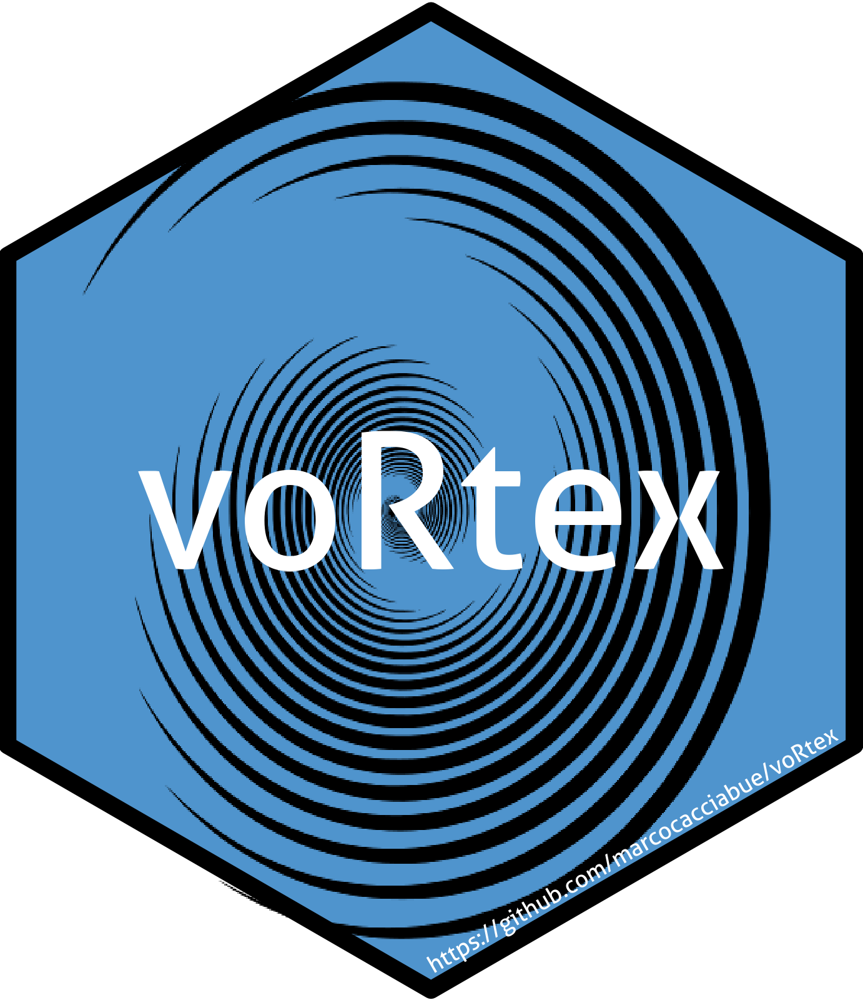

<!-- README.md is generated from README.Rmd. Please edit that file -->

```{r, include = FALSE}
knitr::opts_chunk$set(
  collapse = TRUE,
  comment = "#>",
  fig.path = "man/figures/README-",
  dpi=300,
  out.width = "100%"

)
app_name <- "voRtex"
```

# **`r app_name `**  


## **`r app_name `** is an R package


